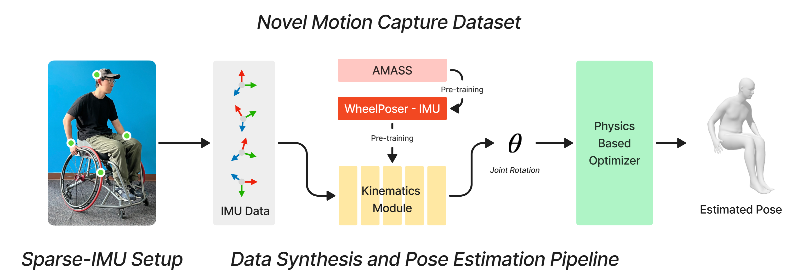

# WheelPoser: Sparse-IMU Based Body Pose Estimation for Wheelchair Users

Open-source code, model, and dataset for our ASSETS 2024 paper "WheelPoser: Sparse-IMU Based Body Pose Estimation for Wheelchair Users"
[[DOI]](https://doi.org/10.1145/3663548.3675638) [[arXiv]](https://arxiv.org/abs/2409.08494)




## Installation

### Python Environment and Dependencies
This code was developed in `python 3.7.12`. For dependencies, please install the latest `pytorch chumpy vctoolkit open3d pybullet qpsolvers cvxopt pytorch-lightning opencv-python tqdm`.

*Installing `pytorch` with CUDA is highly recommended.

If you want to use the physics optimization module, please also compile and install [rbdl](https://github.com/rbdl/rbdl) with python bindings and the urdf reader addon enabled.

### Prepare SMPL Model
1. Register and download the SMPL model from [the official website](https://smpl.is.tue.mpg.de/). Choose "SMPL for Python" and download "Version 1.0.0 for Python 2.7 (10 shape PCs)."
2. Update the `smpl_model_path` variable in `config.py` to point to the downloaded model file.

## Training and Evaluation

### Prepare the AMASS Dataset
1. Register and download the AMASS dataset from the [AMASS website](https://amass.is.tue.mpg.de/), selecting "SMPL+H G" for each dataset.
2. Extract the downloaded datasets and place them in the `src/data/dataset_raw/AMASS` directory.

### Prepare the WheelPoser-IMU Dataset
1. To obtain the dataset, please email [yunzhil@cs.cmu.edu](mailto:yunzhil@cs.cmu.edu) to request the download link.
2. Extract the dataset and place it in the `src/data/dataset_raw/WheelPoser` directory.
3. Please note, we are working on making the WheelPoser-IMU dataset available for download directly from the AMASS website. The public download link will be updated here once it becomes available.

### Prepare Training and Fine-Tuning Dataset
1. Run `1.1 preprocess_all.py` to generate synthetic IMU data for the AMASS dataset and extract ground truth IMU data for the WheelPoser-IMU dataset.
2. Run `1.2 combine_for_nn.py` to organize the synthetic IMU data, ground truth IMU data, and pose ground truth data for model training and fine-tuning.

### Model Training and Fine-Tuning
Execute `scripts/run_all_training.py` to train and fine-tune the model.

### Evaluation
We provide scripts for leave-one-subject-out evaluation of the trained model, supporting both offline and online (real-time) evaluations. While the paper reports online evaluation results, offline evaluation scripts can produce smoother, more accurate motion predictions for non-real-time applications.

1. Use the scripts in `2.2.2 Offline Evaluation` for offline leave-one-subject-out evaluation.
2. Use the scripts in `2.2.3 Online Evaluation` for online leave-one-subject-out evaluation, with options to include or exclude the physics optimization module depending on your application needs.

## Live Demo

### Prepare Pre-trained Network Weights
- Download the network weights from [here]().
- Place the downloaded files in the `checkpoints` folder.

### Set Up IMU Sensors
We use 4 Movella DOT IMUs for the live demo:
1. Install the Movella DOT SDK on your machine by following [the official guide](https://base.movella.com/s/article/Movella-DOT-PC-SDK-Guide?language=en_US).
2. Perform a heading reset for all 4 IMU sensors before each use to improve pose estimation accuracy.

### Set Up Unity3D Visualizer
We use Unity3D to visualize real-time pose estimation. Download a sample Unity scene file [here](). 

### Run the Live Demo
Run `3.1 3_stage_live_demo.py` and open the Unity3D visualizer to view the pose estimation results in real time.

## Acknowledgements
We would like to thank the following contributors that our code is based on:
[TransPose](https://github.com/Xinyu-Yi/TransPose), [PIP](https://github.com/Xinyu-Yi/PIP/tree/main), [IMUPoser](https://github.com/FIGLAB/IMUPoser/tree/main), and [TIP](https://github.com/jyf588/transformer-inertial-poser).

## Citation

If you find the project helpful, please consider citing us:

```
 
```


Shield: [![CC BY-NC 4.0][cc-by-nc-shield]][cc-by-nc]

This work is licensed under a
[Creative Commons Attribution-NonCommercial 4.0 International License][cc-by-nc].

[![CC BY-NC 4.0][cc-by-nc-image]][cc-by-nc]

[cc-by-nc]: https://creativecommons.org/licenses/by-nc/4.0/
[cc-by-nc-image]: https://licensebuttons.net/l/by-nc/4.0/88x31.png
[cc-by-nc-shield]: https://img.shields.io/badge/License-CC%20BY--NC%204.0-lightgrey.svg